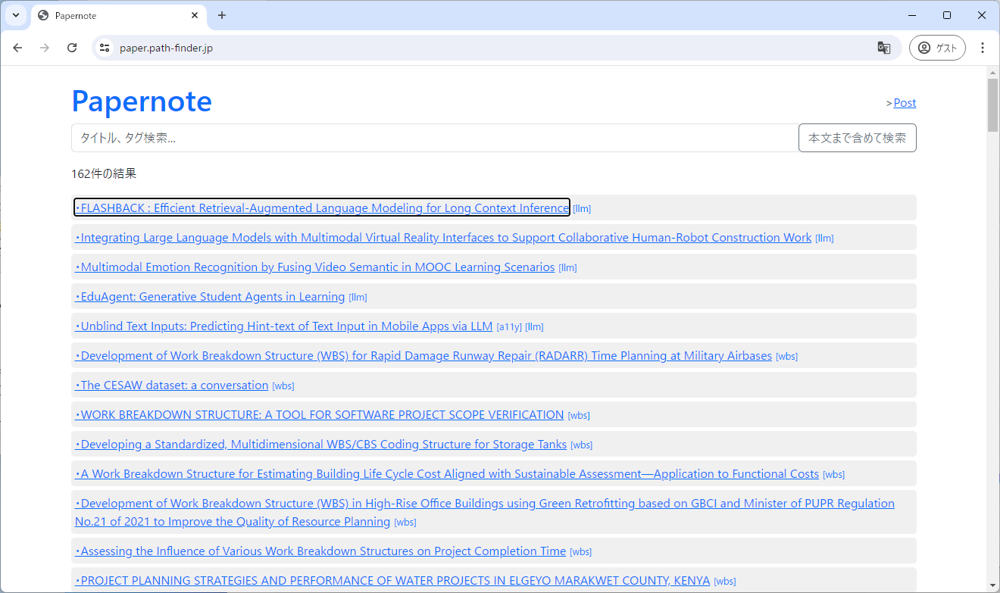
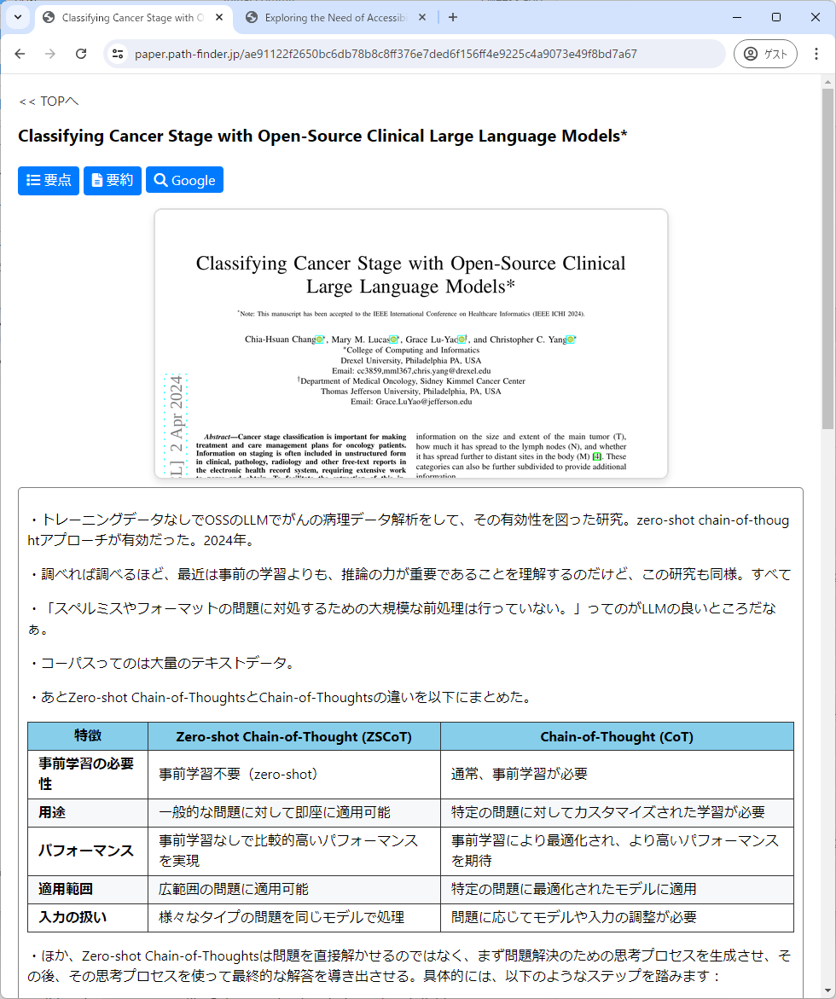

# Papernote



日本語のREADMEは、英語のREADMEの後に記載されています。

## Overview
Papernote is a web application that manages PDF files and their associated notes. It includes features like file upload, text extraction, file search, user authentication, rate limiting, CSRF protection, real-time Markdown preview, AI-powered editing assistance, automatic backups with diff viewing, and extensive keyboard shortcuts. The application can be accessed from anywhere, not just on a PC but also on a smartphone, with full mobile optimization.



## Installation
1. Ensure `ffmpeg` is installed on your system.
2. Clone the repository:
   ```bash
   git clone https://github.com/daishir0/Papernote
   ```
3. Change to the project directory:
   ```bash
   cd Papernote
   ```
4. Install the required packages:
   ```bash
   pip install -r requirements.txt
   ```
5. Rename `config.yaml.org` to `config.yaml` and configure the application by editing the `config.yaml` file. Below are the descriptions of each field:
   - `allowed_extensions`: A list of allowed file extensions for uploads.
     - Supported extensions: `jpg`, `jpeg`, `png`, `gif`, `heic`, `txt`, `pdf`, `docx`, `doc`, `xlsx`, `xls`, `pptx`, `ppt`, `zip`.
   - `exclude_string`: A string that, if found in a memo line, excludes that line from being shown.
   - `twitter`: Contains Twitter metadata for the site and creator.
     - `site`: The Twitter handle of the site.
     - `creator`: The Twitter handle of the content creator.
   - `server`: Contains port.
     - `port`: Server port.
   - `openai_api_key`: Your OpenAI API key for integration.
   - `gmail`: Contains Gmail configuration for sending emails.
     - `sender_email`: The email address used to send emails.
     - `recipient_email`: The email address to receive emails.
     - `app_password`: The application-specific password for Gmail.
   - `secret_key`: A secret key for session management and CSRF protection.
   - `users`: Contains user information for login.
     - `username`: The username for login.
     - `password`: The password for login.

## Usage
1. Start the application:
   ```bash
   python app.py
   ```
2. Access the web interface at `http://localhost:5555`.

## Features
### Core Features
- **User Authentication**: Secure login and logout functionality using Flask-Login.
- **Rate Limiting**: Protect routes from abuse with Flask-Limiter.
- **CSRF Protection**: Secure forms with Flask-WTF CSRF protection (8-hour session timeout).
- **PDF Management**: Upload, search, and manage PDF files.
- **Text Extraction**: Extract and clean text from PDF files.
- **Email Notifications**: Send email notifications for login attempts and other events.
- **File Attachments**: Upload and manage file attachments with drag-and-drop support.

### Editing & Writing Features
- **Real-time Markdown Preview**: Live preview of Markdown content with synchronized scrolling (PC only).
- **AI Assistant**: Integrated AI editing assistant with customizable templates and system prompts (ALT+A).
- **Keyboard Shortcuts**: Extensive keyboard shortcuts for efficient editing:
  - `ALT+1`: Heading (#)
  - `ALT+2`: Unordered list (-)
  - `ALT+3`: Ordered list (1.)
  - `ALT+4`: Blockquote (>)
  - `ALT+5`: Bold text
  - `ALT+6`: 4-space indent toggle
  - `Ctrl+K` or `CMD+K`: Quick page navigation
  - `Ctrl+S`: Save current page
- **Multi-line Markdown Formatting**: Apply Markdown formatting to multiple lines simultaneously.
- **Quick Insert Menu**: Overlay-based insert menu for dates, times, and common templates.
- **Comment Addition**: Quick comment insertion for collaborative editing.

### File & Media Management
- **Multiple File Upload**: Drag-and-drop multiple files at once with visual upload progress.
- **HEIC Image Support**: Automatic HEIC to JPEG conversion for iPhone photos.
- **Image Slideshow**: Built-in slideshow viewer with image preloading for smooth transitions.
- **File Attachment Management**: Upload images, documents, and files with automatic Markdown link generation.

### Backup & History
- **Backup Management System**:
  - Automatic backups with timestamp-based naming (YYYYMMDD-HH format).
  - View backup history (latest 10 backups).
  - Diff viewer to compare backup with current version (color-coded).
  - Quick restore and copy functionality.
  - Mobile-optimized backup interface.

### Navigation & Organization
- **Quick Page Switcher**: Fast page navigation with fuzzy search (Ctrl+K).
- **Open in New Tab**: Open any page in a new browser tab for parallel viewing.
- **File List Caching**: Improved performance with intelligent file list caching.
- **Dynamic Browser Titles**: Page titles automatically update based on content.
- **Persistent Preview State**: Preview pane state saved in localStorage.

### Mobile Optimization
- **Responsive Design**: Fully optimized for smartphone and tablet use.
- **Touch-friendly Buttons**: Large, well-spaced buttons for easy touch interaction.
- **Mobile Toolbar**: Optimized toolbar layout for mobile screens.
- **Grid Layout**: 2-column button grid on mobile for better accessibility.

### Security Enhancements
- **Open Redirect Protection**: Fixed open redirect vulnerability in login flow.
- **Extended Session Timeout**: CSRF token timeout extended to 8 hours.
- **Secure File Uploads**: Comprehensive file validation and sanitization.

### UI/UX Improvements
- **Favicon**: Custom Papernote favicon for better branding.
- **Button Styling**: Unified color scheme and consistent button design.
- **Overlay Dialogs**: Modern overlay-based UI for better user experience.
- **Auto-scroll Prevention**: Smart scroll management after button actions.

## Tools
### PDF to PaperNote Processor
A command-line tool that processes academic paper PDFs and generates files for the PaperNote system:
- Copies and renames PDF files using hash values
- Detects and copies attachment files (al-prefix files)
- Generates Twitter Card images (from the first page of PDFs)
- Extracts and formats clean text from PDFs
- Creates memo files containing paper titles (AI-extracted)
- Generates chapter-by-chapter summaries (AI-generated)
- Creates paper evaluations (peer review reports, AI-generated)

Usage:
```bash
python pdf_to_papernote.py [options] <PDF_file> [<PDF_file> ...]
```

Options:
- `-output`: Outputs files in a directory structure based on paper metadata
- `-openai`: Uses OpenAI's o3-mini model instead of Claude for summaries and evaluations

Example commands:
```bash
# Process a single PDF file
python pdf_to_papernote.py example.pdf

# Process multiple PDF files
python pdf_to_papernote.py a.pdf b.pdf

# Process all PDF files using wildcard
python pdf_to_papernote.py *.pdf

# Process with metadata-based directory output
python pdf_to_papernote.py -output example.pdf

# Use OpenAI model
python pdf_to_papernote.py -openai example.pdf

# Combine multiple options
python pdf_to_papernote.py -output -openai example.pdf
```

## Notes
- Ensure that the `config.yaml` file is properly configured.
- The application requires a running instance of Flask and other dependencies specified in `requirements.txt`.

## License
This project is licensed under the MIT License - see the LICENSE file for details.


---

# Papernote

## 概要
PapernoteはPDFファイルとそれに関連するメモを管理するウェブアプリケーションです。ファイルアップロード、テキスト抽出、ファイル検索、ユーザー認証、レート制限、CSRF保護、リアルタイムMarkdownプレビュー、AI編集アシスタント、差分表示付き自動バックアップ、豊富なキーボードショートカットなどの機能を含んでいます。論文を読んで、Markdown/Mermaidで自由にメモが書けて蓄積でき、PCだけでなくスマホでどこからでもアクセスできます。モバイルにも完全最適化されています。


## インストール方法
1. `ffmpeg`がシステムにインストールされていることを確認します。
2. リポジトリをクローンします：
   ```bash
   git clone https://github.com/daishir0/Papernote
   ```
3. プロジェクトディレクトリに移動します：
   ```bash
   cd Papernote
   ```
4. 必要なパッケージをインストールします：
   ```bash
   pip install -r requirements.txt
   ```
5. `config.yaml.org`を`config.yaml`にリネームし、アプリケーションを設定します。各フィールドの説明は以下の通りです：
   - `allowed_extensions`: アップロードが許可されているファイル拡張子のリスト。
     - サポートされている拡張子: `jpg`, `jpeg`, `png`, `gif`, `heic`, `txt`, `pdf`, `docx`, `doc`, `xlsx`, `xls`, `pptx`, `ppt`, `zip`。
   - `exclude_string`: メモ行に含まれている場合、その行を表示から除外する文字列。
   - `twitter`: サイトとクリエイターのためのTwitterメタデータを含みます。
     - `site`: サイトのTwitterハンドル。
     - `creator`: コンテンツクリエイターのTwitterハンドル。
   - `server`: ポート番号を含みます。
     - `port`: サーバーのポート番号。
   - `openai_api_key`: OpenAI APIキー。
   - `gmail`: メール送信のためのGmail設定を含みます。
     - `sender_email`: メール送信に使用するメールアドレス。
     - `recipient_email`: メールを受信するメールアドレス。
     - `app_password`: Gmailのアプリケーション固有のパスワード。
   - `secret_key`: セッション管理とCSRF保護のためのシークレットキー。
   - `users`: ログイン用のユーザー情報を含みます。
     - `username`: ログイン用のユーザー名。
     - `password`: ログイン用のパスワード。

## 使い方
1. アプリケーションを開始します：
   ```bash
   python app.py
   ```
2. `http://localhost:5555`でウェブインターフェースにアクセスします。

## 機能
### 基本機能
- **ユーザー認証**: Flask-Loginを使用した安全なログインとログアウト機能。
- **レート制限**: Flask-Limiterでルートを保護し、濫用を防止。
- **CSRF保護**: Flask-WTF CSRF保護でフォームを安全に（8時間のセッションタイムアウト）。
- **PDF管理**: PDFファイルのアップロード、検索、管理。
- **テキスト抽出**: PDFファイルからテキストを抽出し、クリーンアップ。
- **メール通知**: ログイン試行やその他のイベントに対するメール通知を送信。
- **ファイル添付**: ドラッグ&ドロップ対応のファイル添付アップロードと管理。

### 編集・執筆機能
- **リアルタイムMarkdownプレビュー**: Markdownコンテンツのライブプレビューとスクロール同期（PC専用）。
- **AIアシスタント**: カスタマイズ可能なテンプレートとシステムプロンプトを備えた統合AI編集アシスタント（ALT+A）。
- **キーボードショートカット**: 効率的な編集のための豊富なキーボードショートカット：
  - `ALT+1`: 見出し（#）
  - `ALT+2`: 箇条書き（-）
  - `ALT+3`: 番号付きリスト（1.）
  - `ALT+4`: 引用（>）
  - `ALT+5`: 太字
  - `ALT+6`: 4スペースインデントのトグル
  - `Ctrl+K` または `CMD+K`: クイックページナビゲーション
  - `Ctrl+S`: 現在のページを保存
- **複数行Markdown整形**: 複数行に対して一括でMarkdown書式を適用。
- **クイック挿入メニュー**: 日付、時刻、よく使うテンプレートのためのオーバーレイ式挿入メニュー。
- **コメント追加**: 共同編集のためのクイックコメント挿入。

### ファイル・メディア管理
- **複数ファイルアップロード**: 一度に複数ファイルをドラッグ&ドロップ、視覚的なアップロード進捗表示。
- **HEIC画像対応**: iPhoneの写真を自動的にHEICからJPEGに変換。
- **画像スライドショー**: 画像プリローディング機能付きのスムーズなスライドショービューア。
- **ファイル添付管理**: 画像、ドキュメント、ファイルのアップロードと自動Markdownリンク生成。

### バックアップ・履歴
- **バックアップ管理システム**:
  - タイムスタンプベースの命名（YYYYMMDD-HH形式）による自動バックアップ。
  - バックアップ履歴表示（最新10件）。
  - バックアップと現在のバージョンを比較する差分ビューア（色分け表示）。
  - クイック復元とコピー機能。
  - モバイル最適化されたバックアップインターフェース。

### ナビゲーション・整理
- **クイックページスイッチャー**: ファジー検索による高速ページナビゲーション（Ctrl+K）。
- **新しいタブで開く**: 任意のページを新しいブラウザタブで開いて並行表示。
- **ファイルリストキャッシュ**: インテリジェントなファイルリストキャッシュによるパフォーマンス向上。
- **動的ブラウザタイトル**: コンテンツに基づいてページタイトルが自動更新。
- **プレビュー状態の永続化**: プレビューペインの状態をlocalStorageに保存。

### モバイル最適化
- **レスポンシブデザイン**: スマートフォンとタブレットに完全最適化。
- **タッチフレンドリーボタン**: タッチ操作に最適な大きく間隔の広いボタン。
- **モバイルツールバー**: モバイル画面に最適化されたツールバーレイアウト。
- **グリッドレイアウト**: モバイルでのアクセシビリティ向上のための2列ボタングリッド。

### セキュリティ強化
- **オープンリダイレクト保護**: ログインフローのオープンリダイレクト脆弱性を修正。
- **セッションタイムアウト延長**: CSRFトークンのタイムアウトを8時間に延長。
- **安全なファイルアップロード**: 包括的なファイル検証とサニタイゼーション。

### UI/UX改善
- **ファビコン**: ブランディング向上のためのPapernoteカスタムファビコン。
- **ボタンスタイリング**: 統一されたカラースキームと一貫したボタンデザイン。
- **オーバーレイダイアログ**: より良いユーザー体験のためのモダンなオーバーレイベースUI。
- **自動スクロール防止**: ボタンアクション後のスマートなスクロール管理。

## ツール
### PDF論文処理ツール
学術論文のPDFファイルを処理し、PaperNoteシステム用のファイルを生成するコマンドラインツールです：
- PDFファイルのコピーとハッシュ値によるリネーム
- 添付ファイル（al-プレフィックスファイル）の検出とコピー
- Twitter Card用の画像生成（PDFの1ページ目から）
- PDFからのテキスト抽出と整形
- 論文のタイトルを含むメモファイルの作成（AI抽出）
- 論文の章ごとの要約生成（AI生成）
- 論文の評価レポート作成（査読レポート、AI生成）

使用方法：
```bash
python pdf_to_papernote.py [オプション] <PDFファイル> [<PDFファイル> ...]
```

オプション：
- `-output`: 論文メタデータに基づいたディレクトリ構造でファイルを出力
- `-openai`: 要約や評価の生成にClaudeの代わりにOpenAIのo3-miniモデルを使用

使用例：
```bash
# 単一のPDFファイルを処理
python pdf_to_papernote.py example.pdf

# 複数のPDFファイルを処理
python pdf_to_papernote.py a.pdf b.pdf

# ワイルドカードを使用して全てのPDFファイルを処理
python pdf_to_papernote.py *.pdf

# メタデータベースのディレクトリ出力を有効にして処理
python pdf_to_papernote.py -output example.pdf

# OpenAIのモデルを使用して処理
python pdf_to_papernote.py -openai example.pdf

# 複数のオプションを組み合わせて処理
python pdf_to_papernote.py -output -openai example.pdf
```

## 注意点
- `config.yaml`ファイルが正しく設定されていることを確認してください。
- アプリケーションにはFlaskと`requirements.txt`に記載された他の依存関係が必要です。

## ライセンス
このプロジェクトはMITライセンスの下でライセンスされています。詳細はLICENSEファイルを参照してください。
